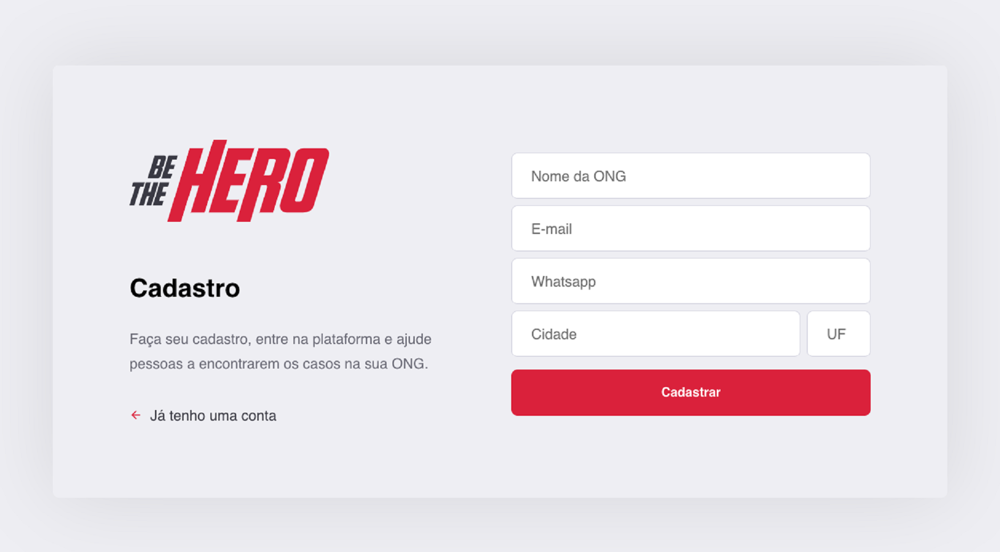
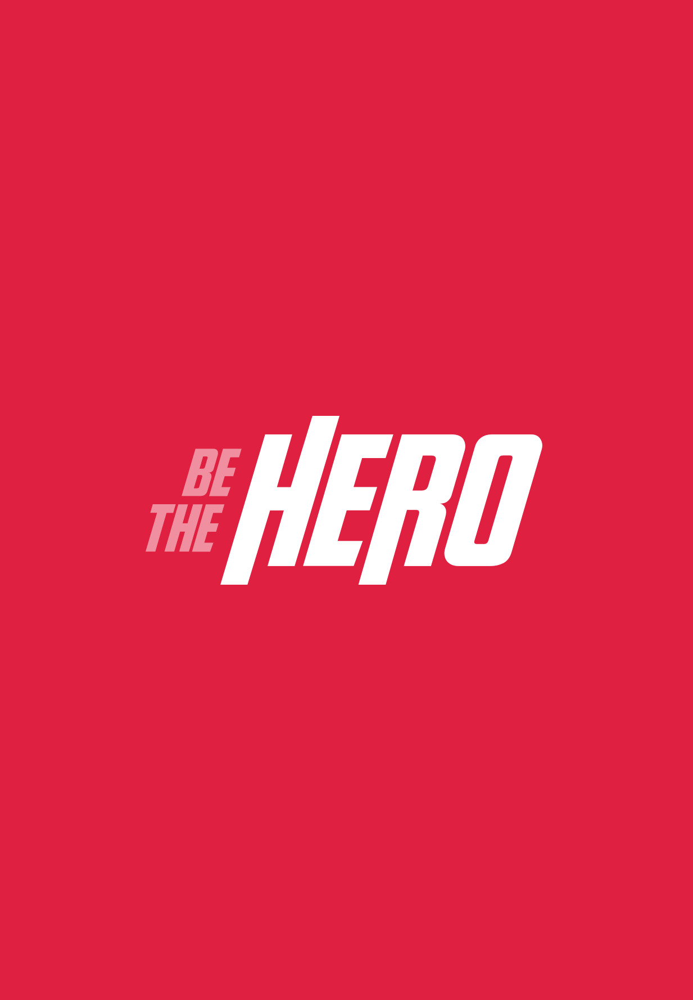

<h1 align="center">
    
</h1>

<h5 align="center">
Be The Hero - project developed at OmniStack Week 11.0<br>
A platform to help ONGs with open campaigns
</h5>

<p align="center">
  <a href="#Project">Project</a>&nbsp;&nbsp;&nbsp;|&nbsp;&nbsp;&nbsp;
  <a href="#Technologies">Technologies</a>&nbsp;&nbsp;&nbsp;|&nbsp;&nbsp;&nbsp;
  <a href="#Getting-started">Installation</a>&nbsp;&nbsp;&nbsp;|&nbsp;&nbsp;&nbsp;
  <a href="#To-perform-your-tests">Test</a>&nbsp;&nbsp;&nbsp;|&nbsp;&nbsp;&nbsp;
  <a href="#How-to-contribute">Contribute</a>&nbsp;&nbsp;&nbsp;|&nbsp;&nbsp;&nbsp;
  <a href="#License">License</a>
</p>

<br>

<h3 align="center">
    
    
    
    <div align="center">
        
        
        
    </div>
</h3>


## Project (Be The Hero)

Be The Hero connects ONGs that need help to people who want to help. In it, ONGs will register campaigns and interested people can donate any amount to the cause. The App created during the week OmniStack 11.0, a complete application from the back-end to the front-end, made with Stack from Node.js, React and React Native.

## Technologies

- [NodeJs](https://nodejs.org/en/)
- [React](https://reactjs.org/)
- [React Native](https://facebook.github.io/react-native/)
- [SQLite](https://www.sqlite.org/index.html)
- [Expo](https://expo.io/)
- [Insomnia](https://insomnia.rest/)


## Getting started

Install the dependencies on the backend and start:
```bash
    cd backend
    $ yarn install
    $ yarn dev
```

Install the dependencies on the frontend and start:
```bash
    cd frontend
    $ yarn install
    $ yarn start
```

To run the mobile project follow the step by step installation of the [Expo](https://docs.expo.io/versions/latest/):
Install the dependencies on the mobile and start:
```bash
    cd mobile
    $ yarn install
    $ yarn start
```

## To perform your tests:
```bash
    $ yarn test
```

## How to contribute

- Make a fork;
- Create a branck with your feature: `git checkout -b my-feature`;
- Commit changes: `git commit -m 'feat: My new feature'`;
- Make a push to your branch: `git push origin my-feature`.

## License

MIT [License](https://github.com/Renatodeluna/BeTheHero/blob/master/LICENSE)
Copyright 2020 © [*Renato de Luna*](https://github.com/renatodeluna) - Made with ♥